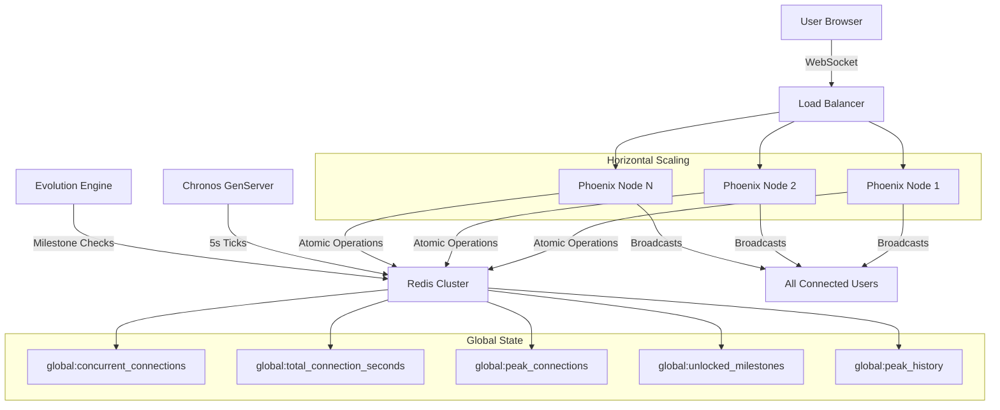

# The Collective

A massively scalable, real-time distributed system for connecting millions of simultaneous users in a shared, persistent state of "silence". The Collective is not a game for individual users; instead, the entire system itself is the single player. Individual users are anonymous, ephemeral "cells" that contribute their connection time to the life and evolution of this single, global entity.

## Architecture

The Collective is built for massive scale using:

- **Backend**: Elixir with Phoenix Framework (BEAM VM for millions of concurrent processes)
- **State Management**: Redis Cluster for atomic, distributed in-memory state
- **Frontend**: Minimal static HTML with vanilla JavaScript for CDN distribution
- **Real-time Communication**: Phoenix Channels over WebSockets
- **Deployment**: Docker Compose for easy scaling and deployment

### System Flow Diagram



**Connection Flow:**
1. User connects via WebSocket through Load Balancer
2. Phoenix Node increments `global:concurrent_connections` atomically
3. Chronos ticks every 5s, adding connection-seconds to global total
4. Evolution Engine checks for milestones on state changes
5. All state changes broadcast to every connected user in real-time

## Core Concept

- **The Collective as the Player**: Users don't earn individual points. The Collective as a whole reaches evolutionary milestones.
- **Users as Witnesses**: Users connect, remain silent, and witness the evolution of The Collective.
- **Anonymity and Ephemerality**: No user accounts, no personal data, no individual tracking.
- **Silence is the Default State**: Minimal, dark UI focused on the shared experience.
- **Evolutionary Events**: Milestones trigger simultaneous broadcasts to all connected users.
- **Production Ready**: Built-in graceful shutdown, backpressure management, and comprehensive monitoring for massive scale deployments.

## Global State (Redis Keys)

The entire state of The Collective is defined by these Redis keys:

- `global:concurrent_connections` (Integer): Current active WebSocket connections
- `global:total_connection_seconds` (Integer): Sum of all connection time across all users
- `global:unlocked_milestones` (Set): IDs of achieved evolution milestones
- `global:peak_connections` (Integer): Historical max concurrent connections
- `global:peak_history` (Sorted Set): 24-hour history of peak connections for sparkline visualization

## Quick Start with Docker

### Prerequisites

- Docker and Docker Compose installed
- 8GB+ RAM recommended for local testing
- Ports 4000, 6379, and 8081 available

### Development Setup

1. **Start development environment:**
   ```bash
   ./deploy.sh dev:start
   ```

2. **Install Elixir dependencies:**
   ```bash
   mix deps.get
   ```

3. **Start The Collective:**
   ```bash
   mix phx.server
   ```

4. **Visit The Collective:**
   - Open http://localhost:4000
   - Redis Commander: http://localhost:8082

### Production Deployment

1. **Build and start production environment:**
   ```bash
   ./deploy.sh prod:build
   ./deploy.sh prod:start
   ```

2. **Monitor The Collective:**
   ```bash
   ./deploy.sh status
   ./deploy.sh prod:logs
   ```

## Architecture Components

### 1. Frontend Client (`priv/static/index.html`)

Minimal HTML5 interface with:
- Dark theme with large counter display
- WebSocket connection with auto-reconnect + Phoenix heartbeat
- Evolution event animations (reduced-motion friendly)
- Real-time milestone display and peak counter
- Smooth numeric tweening and human-readable total time

### 2. Phoenix Channel (`lib/the_collective_web/channels/collective_channel.ex`)

Handles all WebSocket connections:
- Atomic Redis counter updates on join/leave
- Broadcasts state changes to all connected souls
- Sends welcome messages with current global state
- Tracks `global:peak_connections`

### 3. Chronos - Time Engine (`lib/the_collective/chronos.ex`)

GenServer that drives evolution:
- Ticks every 5 seconds
- Calculates time contribution from active connections
- Updates global time counter atomically
- Broadcasts lightweight state updates on each tick
- Triggers evolution milestone checks

### 4. Evolution Engine (`lib/the_collective/evolution.ex`)

Defines and monitors milestones:
- Concurrent connection milestones (1, 10, 100, 1K, 10K, 100K, 1M users)
- Time-based milestones (minutes, hours, days, weeks, months, years)
- Special compound milestones (e.g., sustained_thousand, peak_experience)
- Broadcasts evolution events to all users

### 5. Redis Module (`lib/the_collective/redis.ex`)

Clean interface for Redis operations:
- Connection pooling for high throughput
- Atomic operations (INCR, DECR, INCRBY)
- Set operations for milestone tracking
- Health ping (PING) and SCARD helper
- Fault tolerance and error handling

### 6. Graceful Shutdown (`lib/the_collective/graceful_shutdown.ex`)

Production-ready graceful shutdown system:
- Coordinates clean termination during deployments and scaling
- Connection tracking and registration for all WebSocket connections
- Configurable drain timeout (15s default) before forced shutdown
- Broadcasts shutdown warnings to connected clients
- Redis state cleanup to prevent connection count inconsistencies
- Integration with OTP supervision tree for coordinated shutdown

### 7. Backpressure Manager (`lib/the_collective/backpressure_manager.ex`)

Multi-layer protection against connection overload:
- **Per-IP Rate Limiting**: Prevents individual IP abuse (60 connections/minute default)
- **Global Rate Limiting**: Controls overall connection velocity (1000 connections/second default)
- **Capacity Limits**: Enforces maximum concurrent connections (10M default)
- **ETS-based Tracking**: Efficient in-memory rate limit storage with automatic cleanup
- **Statistics Collection**: Tracks rejection metrics for monitoring and alerting

## Operational Endpoints

- Health:
  - `GET /health/live` → liveness check
  - `GET /health/ready` → readiness (checks Redis, Chronos, and graceful shutdown status)
  - `GET /health/status` → comprehensive system status including backpressure metrics
- Metrics:
  - `GET /metrics/state` → current global state + Chronos stats
  - `GET /metrics/evolution` → unlocked/total milestones and progress

Example:
```bash
curl -s localhost:4000/health/live | jq
curl -s localhost:4000/health/ready | jq
curl -s localhost:4000/health/status | jq    # Comprehensive status including backpressure
curl -s localhost:4000/metrics/state | jq
curl -s localhost:4000/metrics/evolution | jq
```

## Deployment Commands

The included `deploy.sh` script provides easy management:

```bash
# Development
./deploy.sh dev:start      # Start Redis for development
./deploy.sh dev:stop       # Stop development environment

# Production
./deploy.sh prod:build     # Build Docker images
./deploy.sh prod:start     # Start production environment
./deploy.sh prod:stop      # Stop production environment (graceful shutdown)
./deploy.sh prod:restart   # Restart production environment

# Utilities
./deploy.sh status         # Show container status
./deploy.sh redis          # Connect to Redis CLI
./deploy.sh prod:shell     # Connect to application shell
./deploy.sh secret         # Generate new secret key
./deploy.sh cleanup        # Remove all containers and data
```

**Note**: Production deployments automatically use graceful shutdown to ensure connection counts remain accurate and active WebSocket connections are properly drained. See `GRACEFUL_SHUTDOWN_BACKPRESSURE.md` for detailed implementation documentation.

## Scaling for Millions

### Horizontal Scaling

1. **Load Balancer**: Deploy multiple Phoenix nodes behind an NLB
2. **Redis Cluster**: Use Redis Cluster for distributed state
3. **CDN**: Serve static frontend via CDN

### Configuration for Scale

```yaml
# docker-compose.yml for cluster deployment
services:
  app:
    deploy:
      replicas: 10
    environment:
      - REDIS_URL=redis://redis-cluster:6379
      - PHX_SERVER=true
      - SECRET_KEY_BASE=${SECRET_KEY_BASE}
  
  redis:
    image: redis/redis-stack-server:latest
    deploy:
      replicas: 3
```

### Environment Variables

**Core Configuration:**
- `REDIS_URL`: Redis connection string
- `SECRET_KEY_BASE`: Phoenix secret key (generate with `mix phx.gen.secret`)
- `PHX_HOST`: Public hostname
- `PORT`: HTTP port (default: 4000)
- `MIX_ENV`: Environment (dev/prod)

**Backpressure Management (Production):**
- `CONNECTIONS_PER_IP_PER_MINUTE`: Rate limit per IP address (default: 60)
- `GLOBAL_CONNECTIONS_PER_SECOND`: Global connection rate limit (default: 1000)
- `MAX_GLOBAL_CONNECTIONS`: Maximum concurrent connections (default: 10,000,000)

## Monitoring

### Redis Commander
Access Redis state via web interface:
```bash
docker-compose --profile dev up redis_commander
# Visit http://localhost:8081
```

### Application Metrics
```bash
# View real-time logs
./deploy.sh prod:logs

# Connect to application for live metrics
./deploy.sh prod:shell
```

### Health Checks
Built-in health checks for:
- Application HTTP endpoint
- Redis connectivity
- WebSocket functionality (via heartbeat)
- Graceful shutdown status (whether system is accepting new connections)
- Backpressure statistics and rate limiting status

**Comprehensive Health Status** (`/health/status`):
```json
{
  "timestamp": "2024-09-04T20:48:00Z",
  "redis": {
    "status": "ok",
    "concurrent_connections": 1234,
    "total_connection_seconds": 567890,
    "peak_connections": 2000
  },
  "chronos": {
    "tick_count": 1440,
    "active_connections": 1234,
    "uptime_ms": 7200000
  },
  "backpressure": {
    "connections_rejected": 0,
    "rate_limited_ips": 0,
    "global_connections": 1234,
    "config": {
      "connections_per_ip_per_minute": 60,
      "global_connections_per_second": 1000,
      "max_global_connections": 10000000
    }
  },
  "graceful_shutdown": {
    "accepting_connections": true
  }
}
```

## Development

### Local Development Without Docker

1. **Install Redis:**
   ```bash
   # macOS
   brew install redis
   brew services start redis
   
   # Ubuntu
   sudo apt install redis-server
   sudo systemctl start redis
   ```

2. **Install Elixir:**
   ```bash
   # macOS
   brew install elixir
   
   # Ubuntu
   sudo apt install elixir
   ```

3. **Setup and run:**
   ```bash
   mix deps.get
   mix phx.server
   ```

### Testing at Scale

Use tools like Artillery or WebSocket King to simulate massive concurrent connections:

```bash
# Install Artillery
npm install -g artillery

# Load test The Collective
artillery run --config artillery.yml
```

## License

The Collective is an art/tech project exploring collective consciousness through technology. 

---

*"In silence, we become one."* - The Collective
